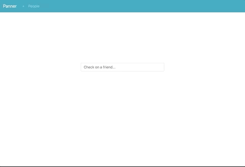

======
Panner
======
Django-powered web app to keep track of friends.

Try it: https://panner.herokuapp.com

Features
--------
- Supports: Meetup, Reddit, Spotify, and Twitter accounts.
- Simple, easy-to-navigate interface.
- Timesaver.
- Robust test coverage.

Requirements
------------
- Python 3.6+
- API client ID/secret values
- Docker_ (highly recommended)

Client ID/Secret Values
-----------------------
.. _values:

- Before running this app, you must acquire client ID/secret values from services that you will use (one or more): Meetup_, Reddit_, Spotify_, and/or Twitter_. Use ``http://127.0.0.1:8000`` as the callback URI.

Run (in Docker)
-----------------
- Get Docker_.

- Clone, set values_, and run in **Django+Postgres+Gunicorn+Nginx** configuration: ::

    $ git clone https://github.com/kylepw/panner.git && cd panner
    $ cp env_template .env && vim .env
    $ docker-compose up --build

- Open ``http://127.0.0.1:8000`` in a browser.

Run (on Django development web server)
----------------------------------------
- Start a Postgres database: ::

    $ docker run --name db -p 5432:5432 -d postgres

- Clone, install dependencies, set values_, setup database, and run::

    $ git clone https://github.com/kylepw/panner.git && cd panner
    $ pip install pipenv && pipenv install
    $ cp env_template .env && vim .env
    $ pipenv shell
    (panner)$ # Make sure you have a Postgres server running at this point.
    (panner)$ export DB_HOST=127.0.0.1
    (panner)$ ./manage.py migrate && ./manage.py loaddata people
    (panner)$ DEBUG=1 ./manage.py runserver
    ...
    Starting development server at http://127.0.0.1:8000/
    Quit the server with CONTROL-C.

- Open ``http://127.0.0.1:8000`` in a browser.

Todo
----
- More tests.
- Caching.
- Multiple user account support.

License
-------
`MIT License <https://github.com/kylepw/panner/blob/master/LICENSE>`_

.. _Docker: https://www.docker.com/products/docker-desktop
.. _Meetup: https://www.meetup.com/meetup_api/
.. _Reddit: https://www.reddit.com/prefs/apps
.. _Spotify: https://developer.spotify.com/dashboard/login
.. _Twitter: https://developer.twitter.com/en/apply/user