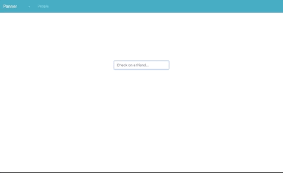

======
Panner
======
Django-powered web app to keep track of friends.

Try it now_ with Docker_.

*Note:* this app is intended for **development**, not production, usage.

Features
--------
- Supports: Meetup, Reddit, Spotify, and Twitter accounts.
- Simple, easy-to-navigate interface.
- Timesaver.
- Robust test coverage.

Requirements
------------
- Python 3.6+
- API client ID/secret values

Client ID/Secret Values
-----------------------
.. _values:

- Before running this app, you must acquire client ID/secret values from services that you will use (one or more): Meetup_, Reddit_, Spotify_, and/or Twitter_. Use ``http://127.0.0.1:8000`` as the callback URI.

Run (with Docker)
-----------------
.. _now:

- Get Docker_.

- Run in Dockerized **Django+Gunicorn+Postgres+Nginx** configuration: ::

    $ git clone https://github.com/kylepw/panner.git && cd panner
    $ # Acquire client ID/secret values (see above).
    $ cp env_template .env && vim .env
    $ docker-compose up
    $ open http://127.0.0.1:8000

Run (from source)
-----------------

- Setup a PostgreSQL server locally with a database and password with...

    Docker_ (``DB_NAME`` and ``DB_USER`` values will default to ``postgres``)::

    $ docker run --name panner-db -e POSTGRES_PASSWORD=mypasswd -d postgres

    -OR- manually (MacOS_, Linux_, etc.).

- Clone, install dependencies, insert values_, migrate database, and run::

    $ git clone https://github.com/kylepw/panner.git && cd panner
    $ pip install pipenv && pipenv install
    (panner)$ cp env_template .env && vim .env
    (panner)$ # Make sure you have PostgreSQL setup and running at this point.
    (panner)$ python manage.py migrate
    (panner)$ python manage.py runserver
    ...
    Starting development server at http://127.0.0.1:8000/
    Quit the server with CONTROL-C.
    (panner)$ open http://127.0.0.1:8000

Todo
----
- Docker image running with PostgreSQL and Nginx.
- More tests.
- Caching.
- Multiple user account support.

License
-------
`MIT License <https://github.com/kylepw/panner/blob/master/LICENSE>`_

.. _Docker: https://www.docker.com/products/docker-desktop
.. _Linux: https://www.digitalocean.com/community/tutorials/how-to-install-and-use-postgresql-on-ubuntu-18-04
.. _MacOS: https://www.robinwieruch.de/postgres-sql-macos-setup/
.. _Meetup: https://www.meetup.com/meetup_api/
.. _Reddit: https://www.reddit.com/prefs/apps
.. _Spotify: https://developer.spotify.com/dashboard/login
.. _Twitter: https://developer.twitter.com/en/apply/user
